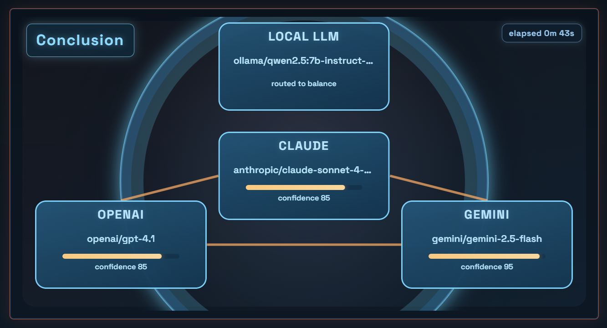

# MAGI v1.1（ローカル利用）



MAGI は、単一プロンプトを入口ルーターで自動振り分けし、軽量タスクは `local_only`（ローカル1モデル）、それ以外は複数LLMの並列実行と合議で処理するローカル実行向けアプリです。  
回答表示だけでなく、モデル別リトライ、合議の再計算、Fresh mode（Web最新情報の補強）、SQLiteへの履歴永続化、`thread_id` ベースの会話継続までを1画面で扱えます。  
v1.1 では、ルーティング学習（feedbackで重み更新）、ルーター誤判定の抑制、実行フェーズを可視化するUI改善（`Routing / Prep`、`Executing`、`Discussion`、`Conclusion`）を追加しています。

## v1.1 ハイライト

- Routing learning（MVP）:
  - `routing_events` / `routing_policy` をSQLiteへ追加
  - `POST /api/magi/routing/feedback` による重み更新
  - Router最終スコアを `base_score + policy_weight` に拡張
- Routerルール改善:
  - `local_only` へのマッピングに `execution_tier=local` 条件を追加
- レイテンシ耐性改善:
  - Geminiは timeout 時に1回リトライ
  - `balance.timeout_seconds` を 45 秒へ調整
- Chamber UI改善:
  - 前処理と実行の表示を分離（`Routing / Prep` → `Executing`）
  - `Executing` 中は3ノードを点滅表示
  - エラーカードのヘッダー操作を `Retry` 優先（`ERROR` 時は `Copy` 非表示）

## 構成

- `backend/`: FastAPI + LiteLLM
- `frontend/`: Next.js（App Router）+ Tailwind CSS
- `SPEC.md`: 実装仕様
- `AGENTS.md`: コーディングエージェント向け作業ルール
- `RUNBOOK.md`: 運用コマンドとトラブルシューティング

## 前提条件

- Python 3.10+
- Node.js 20+
- npm 10+

## 初回セットアップ

### Backend

```bash
cd backend
python -m venv .venv
# Windows PowerShell
.\.venv\Scripts\Activate.ps1
# macOS / Linux
source .venv/bin/activate
pip install -r requirements.txt
copy .env.example .env
# macOS / Linux
cp .env.example .env
```

### Frontend

```bash
cd frontend
npm install
copy .env.example .env.local
# macOS / Linux
cp .env.example .env.local
# Docker MCP で使う場合（任意）
copy .env.mcp.example .env.local
# macOS / Linux
cp .env.mcp.example .env.local
```

## ローカル起動

リポジトリのルートで実行:

```bash
.\start-backend.ps1
```

別ターミナルで実行:

```bash
.\start-frontend.ps1
```

macOS / Linux の場合:

```bash
./start-backend.sh
```

別ターミナルで実行:

```bash
./start-frontend.sh
```

URL:

- Frontend: `http://localhost:3000`
- Backend: `http://localhost:8000`
- Health: `http://localhost:8000/health`

## Docker起動（FE/BE同時）

前提:

- Docker Desktop
- `backend/.env` を設定済み（`backend/.env.example` をコピー）

リポジトリのルートで実行:

```bash
docker compose up --build -d
```

補足:
- Docker構成には `ollama` が含まれます。
- 初回起動時は `ollama-pull` が `qwen2.5:7b-instruct-q4_K_M` を取得するため、少し時間がかかります。

状態確認:

```bash
docker compose ps
```

停止:

```bash
docker compose down
```

URL:

- Frontend: `http://localhost:3000`
- Backend: `http://localhost:8000`

## 環境変数

`backend/.env`

- `OPENAI_API_KEY=`
- `ANTHROPIC_API_KEY=`
- `GEMINI_API_KEY=`
- `TAVILY_API_KEY=`（任意、Fresh modeのWeb取得用）
- `FRESH_MAX_RESULTS=3`（任意、fresh mode安定化向け推奨）
- `FRESH_CACHE_TTL_SECONDS=1800`（任意）
- `FRESH_SEARCH_DEPTH=basic`（任意: `basic|advanced`）
- `FRESH_PRIMARY_TOPIC=general`（任意: `general|news`）
- `SOURCE_MAX_URLS=5`（任意: `source_urls` の最大取得件数）
- `SOURCE_FETCH_TIMEOUT_SECONDS=10`（任意: URL直取得のタイムアウト秒）
- `SOURCE_SNIPPET_CHARS=1200`（任意: 1URLあたり注入文字数）
- `MAGI_DB_PATH=data/magi.db`（任意、Docker/Local 共通推奨）
- `HISTORY_CONTEXT_ENABLED=1`（任意: `0/false` で無効化）
- `HISTORY_SIMILARITY_THRESHOLD=0.78`（任意: 0.0-1.0）
- `HISTORY_SIMILAR_CANDIDATES=120`（任意: 類似検索対象の最新履歴件数）
- `HISTORY_MAX_REFERENCES=2`（任意: プロンプトに注入する参照履歴数）
- `HISTORY_FRESHNESS_HALF_LIFE_DAYS=180`（任意: 履歴スコアの鮮度減衰）
- `HISTORY_STALE_WEIGHT=0.55`（任意: stale 履歴の重み）
- `HISTORY_SUPERSEDED_WEIGHT=0.20`（任意: superseded 履歴の重み）
- `history_context` を `backend/config.json` で設定している場合は、`HISTORY_FRESHNESS_HALF_LIFE_DAYS` / `HISTORY_STALE_WEIGHT` / `HISTORY_SUPERSEDED_WEIGHT` より `config.json` 側を優先
- `THREAD_CONTEXT_ENABLED=1`（任意: `0/false` でスレッド文脈注入を無効化）
- `THREAD_CONTEXT_MAX_TURNS=6`（任意: 参照する直近ターン数）
- `OLLAMA_API_BASE=http://ollama:11434`（Docker Compose時の推奨値）

`frontend/.env.local`

- `NEXT_PUBLIC_API_BASE_URL=http://localhost:8000`
- Docker MCP/コンテナ内ブラウザからアクセスする場合は `NEXT_PUBLIC_API_BASE_URL=http://host.docker.internal:8000` を使用
- サンプルとして `frontend/.env.mcp.example` を用意（`copy .env.mcp.example .env.local`）

## モデル設定

コード変更なしでプロファイルやモデルを切り替えるには、`backend/config.json` を編集します。

```json
{
  "default_profile": "balance",
  "history_context": {
    "strategy": "embedding",
    "provider": "openai",
    "model": "text-embedding-3-small",
    "timeout_seconds": 12,
    "batch_size": 24,
    "freshness_half_life_days": 180,
    "stale_weight": 0.55,
    "superseded_weight": 0.20,
    "deprecations_source": {
      "enabled": true,
      "url": "https://raw.githubusercontent.com/endow/magi/master/backend/deprecations.community.json",
      "mode": "replace",
      "timeout_seconds": 5,
      "refresh_interval_seconds": 86400,
      "allow_http": false
    },
    "deprecations": [
      {
        "id": "authjs-migration",
        "legacy_terms": ["nextauth", "next-auth"],
        "current_terms": ["auth.js", "authjs", "better auth"]
      },
      {
        "id": "next-app-router-migration",
        "legacy_terms": ["pages router", "getserversideprops", "getstaticprops", "_app.tsx", "_document.tsx"],
        "current_terms": ["app router", "route handler", "server component", "layout.tsx"]
      },
      {
        "id": "react-query-rename",
        "legacy_terms": ["react-query", "react query v3"],
        "current_terms": ["tanstack query", "@tanstack/react-query"]
      },
      {
        "id": "next-image-legacy",
        "legacy_terms": ["next/legacy/image", "legacy image component"],
        "current_terms": ["next/image"]
      },
      {
        "id": "prisma-major-upgrade",
        "legacy_terms": ["prisma 4", "prisma4", "previewfeatures"],
        "current_terms": ["prisma 5", "prisma5"]
      },
      {
        "id": "eslint-flat-config",
        "legacy_terms": [".eslintrc", ".eslintrc.js", ".eslintrc.json"],
        "current_terms": ["eslint.config.js", "flat config"]
      },
      {
        "id": "next-font-migration",
        "legacy_terms": ["@next/font", "next font package"],
        "current_terms": ["next/font"]
      },
      {
        "id": "turbo-repo-rename",
        "legacy_terms": ["turborepo", "turbo repo"],
        "current_terms": ["turbo", "turbo.json"]
      }
    ]
  },
  "profiles": {
    "cost": { "...": "..." },
    "balance": { "...": "..." },
    "performance": { "...": "..." },
    "ultra": { "...": "..." }
  }
}
```

`history_context.strategy`:
- `embedding`: 外部埋め込みモデルで類似履歴を検索（失敗時は自動でローカル類似検索へフォールバック）
- `lexical`: ローカル類似検索のみ

`request_router`（任意）:
- `enabled=true` のとき、`POST /api/magi/run` で `profile` 未指定の場合のみ入口LLMで自動ルーティング
- 入口LLMは JSON (`intent`, `complexity`, `safety`, `execution_tier`, `profile`, `confidence`, `reason`) を返し、`min_confidence` 未満は `router_rules.default_profile` にフォールバック
- 例: ローカル Ollama で `provider=ollama`, `model=qwen2.5:7b-instruct-q4_K_M`
- 現行ルール: `translation|rewrite|summarize_short` + `complexity=low` + `safety=low` + `execution_tier=local` は `local_only` へ、それ以外は `balance`

`routing_learning`（任意）:
- ルーティングイベントをSQLiteに保存し、`feedback` と実行結果から profile 重みを更新
- 最終スコアは `base_score + policy_weight`
- 主要設定: `alpha`, `weight_min`, `weight_max`, `latency_threshold_ms`, `cost_threshold`

履歴の扱い:
- データは削除せず保持
- `validity_state` (`active|stale|superseded`) を保持
- 類似検索は `similarity × freshness × validity_weight` でスコアリング
- `deprecations_source.enabled=true` の場合、外部JSONから deprecations を取得（`mode=merge|replace`、取得失敗時はローカル定義へフォールバック）
- community-driven 運用では `backend/deprecations.community.json` を更新して `master` へ push すると、Raw URL経由で自動反映される
- `deprecations` の `current_terms` を含む新規実行が入ると、`legacy_terms` を含む過去履歴を `superseded` に更新
- 現在のサンプルは `nextauth->auth.js`, `pages router->app router`, `react-query->tanstack query` などを含む

## APIメモ

- エンドポイント: `POST /api/magi/run`
- リクエストボディ: `{ "prompt": "...", "profile": "optional: cost|balance|performance|ultra|local_only", "fresh_mode": false, "thread_id": "optional-string", "source_urls": ["optional-https://..."] }`
- `source_urls` 未指定でも、`prompt` に含まれる `http/https` URL は backend が自動抽出して取得し、`[Direct URL Evidence]` として注入されます
- URLアンカー付きリクエスト（`source_urls` 指定 or `prompt` 内URL含有）では、古い履歴混入を避けるため `history_context` をスキップします
- `profile` 未指定の場合、backend router が実行されます（UIの `auto (unset)`）
- Runレスポンスには `consensus`（3者合議で合成された最終回答）が含まれます
- Runレスポンスには `thread_id` と `turn_index` が含まれます
- RunレスポンスはローカルSQLite履歴へ保存されます
- Retryエンドポイント: `POST /api/magi/retry`
- Retryボディ: `{ "prompt": "...", "agent": "A|B|C", "profile": "...", "fresh_mode": false, "thread_id": "optional-string", "source_urls": ["optional-https://..."] }`
- Consensusエンドポイント: `POST /api/magi/consensus`
- Consensusボディ: `{ "prompt": "...", "results": AgentResult[], "profile": "...", "fresh_mode": false, "thread_id": "optional-string", "source_urls": ["optional-https://..."] }`
- Profilesエンドポイント: `GET /api/magi/profiles`
- 履歴一覧エンドポイント: `GET /api/magi/history?limit=20&offset=0`
- 履歴詳細エンドポイント: `GET /api/magi/history/{run_id}`
- スレッド削除エンドポイント: `DELETE /api/magi/history/thread/{thread_id}`
- ルーティングfeedback: `POST /api/magi/routing/feedback`
- ルーティングpolicy参照: `GET /api/magi/routing/policy?key=...`
- ルーティングevents参照: `GET /api/magi/routing/events?thread_id=...&limit=20`
- 同一 `thread_id` の場合、backend はスレッド文脈を有効プロンプトに注入し、最新ターンを専用の `[High Priority Latest Turn]` ブロックとして優先注入します
- 空プロンプトまたは4000文字超過は `400` を返します
- モデルごとのタイムアウトは profile 設定（`backend/config.json`）に従います（現行: local_only 30s / cost 40s / balance 45s / performance 35s / ultra 45s）
- 部分失敗は許容されます（`status: ERROR`）
- Backend は `run_id` を UUID で返します

### Routing Learning 追加内容（MVP）

- `routing_events` テーブル:
  - router input/output、実行結果、user rating を保存
- `routing_policy` テーブル:
  - keyごとの profile weight と統計（`n`, `avg_reward`）を保存
- reward:
  - `rating(+1/-1)`、`error`、`latency_threshold_ms`、`cost_threshold` で計算
- 更新式:
  - `weight += alpha * reward`（`weight_min/weight_max` でclamp）

### 新API curl例

```bash
curl -X POST http://localhost:8000/api/magi/routing/feedback ^
  -H "Content-Type: application/json" ^
  -d "{\"thread_id\":\"<thread_id>\",\"request_id\":\"<run_id>\",\"rating\":1,\"reason\":\"good answer\"}"
```

```bash
curl "http://localhost:8000/api/magi/routing/policy?key=intent=qa|complexity=high|lang=ja"
```

```bash
curl "http://localhost:8000/api/magi/routing/events?thread_id=<thread_id>&limit=20"
```

### テスト実行方法

```bash
python -m pytest backend/tests -q
```

## 現在のUI機能

- Enterで送信（`Shift+Enter` で改行）
- プロンプト文字数カウンター（`0/4000`）
- 3カラムの結果カード表示:
  - status
  - model id
  - latency
  - response text
- カードごとの操作:
  - `Copy`（回答テキストのコピー）
  - `Retry`（失敗カードの再実行）
- Consensusパネル:
  - 3つの結果カードより先に表示
  - 3者合議の最終結論を表示
  - `OK/ERROR` と latency 表示に対応
  - Chamber上部に状態バッジ表示（`Routing / Prep`、`Executing`、`Discussion`、`Conclusion`）
  - `Conclusion` 時は経過時間（分/秒）を表示
- Profileセレクター:
  - `auto (unset)`, `local_only`, `cost`, `balance`, `performance`, `ultra` を選択可能
  - デフォルトは `auto (unset)`。初回実行は `profile` を省略し backend routing を使用
  - 選択した profile は run/retry/consensus に送信
  - `performance` と `ultra` は strict debate consensus（具体的な相互批判が必要）を有効化
  - `performance` / `ultra` 選択時は `strict debate` バッジを表示
  - `ultra` 選択時は `high cost` バッジを表示
- Chamberカード操作:
  - `ERROR` カードは `Retry` のみ表示（`Copy` は非表示）
  - `Executing` 状態では3ノードを点滅表示
- Fresh modeトグル:
  - デフォルトは ON
  - ON時は backend が Tavily で最新Web証拠を取得（`TAVILY_API_KEY` 設定時）
  - `fresh_mode` 未指定でも、`latest/最新` などの時系列語に加え `YouTube/動画/攻略動画` を含む依頼では自動で有効化される場合があります
  - `general/news` のフォールバックとクエリ拡張により、非ニュース系（ゲーム攻略など）も取得しやすくする
  - Tavily が利用不可、またはキー未設定の場合は通常プロンプトへ自動フォールバック
- Run履歴パネル（backend SQLiteに永続化）
- `run_id` 表示とコピーボタン
- `thread_id` 表示（同一チャット継続）
- スレッド単位でターンをグループ表示
- スレッド操作を近代化: インライン `Rename`、アイコン風 `Fold/Expand`、確認付き `Delete`

## トラブルシューティング（ローカル）

- `localhost:3000 refused to connect`: frontend を起動（`.\start-frontend.ps1`）
- 1モデルだけ `status=ERROR`: `backend/config.json` のAPIキーとモデル名を確認
- Anthropic/Gemini だけ失敗: 多くはプロバイダ側のクォータ/クレジット問題
- Docker で履歴が消える: `docker-compose.yml` で `./backend/data:/app/data` がマウントされていること、かつ `MAGI_DB_PATH` は未設定または `data/magi.db` を使用する。
